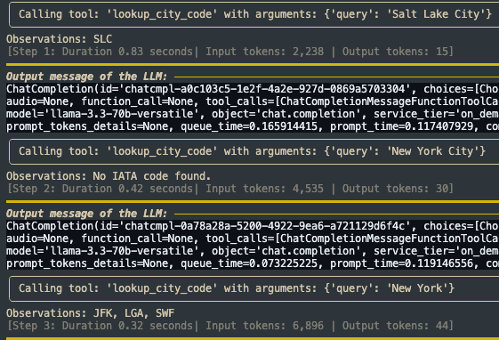
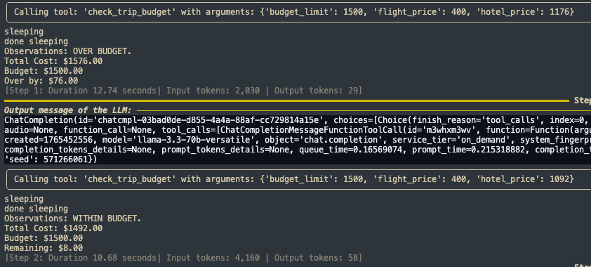
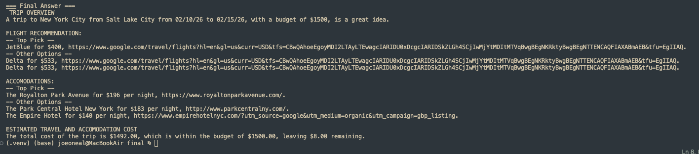

# Virtual Travel Agent

Virtual Travel Agent is a command-line travel planning assistant built with `smolagents`. It takes a natural-language trip request, researches flight and hotel options, checks airport codes, and produces a structured itinerary with links and estimated travel/accommodation costs.

The project uses Groq-hosted language models for agent reasoning, SerpApi for Google Flights and Google Hotels data, a local airport dataset for IATA lookup, and a simple budget tool to compare recommended options against a user's budget.

## Screenshots







## How It Works

The app runs two agents:

- A research agent gathers today's date, airport codes, flight options, and hotel options.
- A planning agent chooses recommendations, calculates trip cost, and writes the final itinerary.

## Setup

Install dependencies:

```bash
pip install -r requirements.txt
```

Create a `.env` file with:

```bash
GROQ_KEY=your_groq_api_key
SERP_KEY=your_serpapi_key
```

## Usage

```bash
python run.py "Plan a trip from Salt Lake City to New York City from 02/10/26 to 02/15/26 with a $1500 budget"
```

